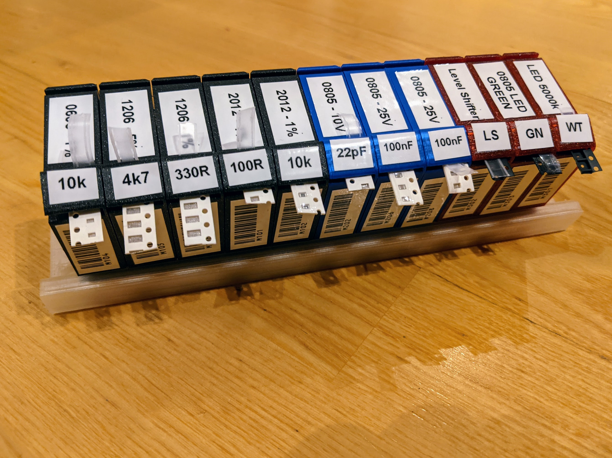

# SMD Component Magazines

### Attribution

This project is adapted from the "SMD Component Magazines" project by robin7331. The original project is available here: [Link to original Project](https://www.thingiverse.com/thing:3952021). The original work is licensed under [Creative Commons - Attribution - Non Commercial license](https://creativecommons.org/licenses/by-nc/4.0/).

### Modifications

Since the original SMD magazines are way too large for my part counts, I have modified the files. The scaled down version is 2/3 the size of the original and therefore are faster to print and much cheaper.

### How To

0. (optional): Use the fusion 360 project to adapt the magazines to your sizes.
1. Print the component magazines and the rails.
2. Use the label template in the labels folder to add labels to your magazines. The templates work with the Brother P-Touch Editor and 12mm labels.

### License

Since this work is only an adaption, it is also published under the [Creative Commons - Attribution - Non Commercial license](https://creativecommons.org/licenses/by-nc/4.0/).

